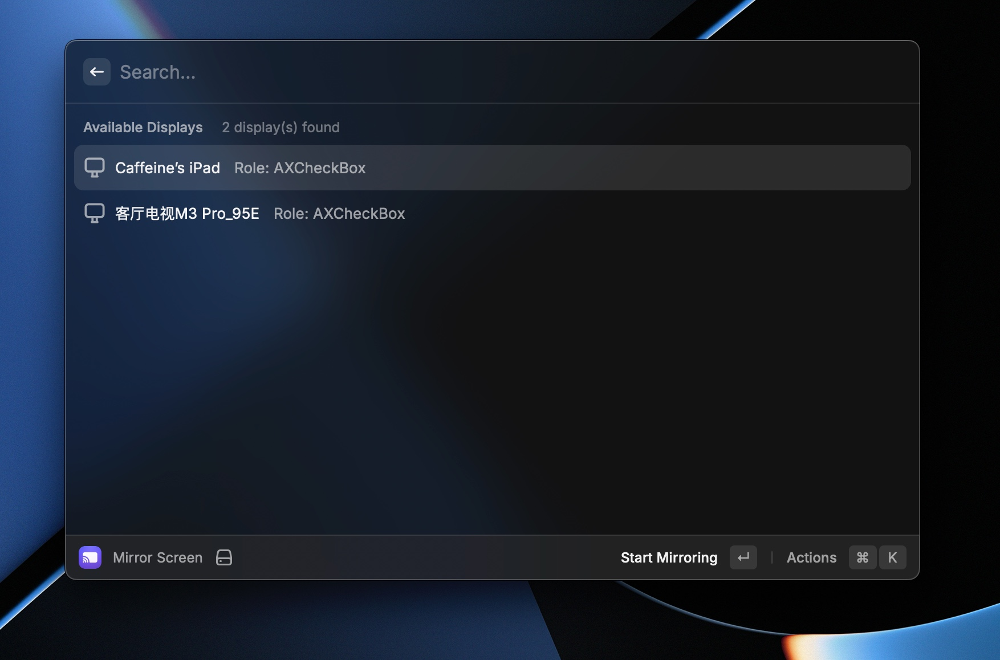

# Screen Mirroring

A Raycast extension that provides seamless control over macOS Screen Mirroring directly from your command palette. Discover available displays and toggle screen mirroring on/off with ease.



## Features

- 🔍 **Auto-Discovery**: Automatically finds all available screen mirroring displays
- 🎯 **One-Click Toggle**: Start or stop mirroring to any display with a single action
- 🟢 **Visual Status**: Green indicators show which displays are currently mirroring
- 💾 **Persistent Cache**: Remembers discovered displays between sessions
- ⚡ **Fast Access**: Control screen mirroring without opening Control Center manually

## Requirements

> ⚠️ **IMPORTANT**: This extension requires Hammerspoon to be installed and running on your Mac. Without Hammerspoon, the extension will not function.

### Essential Dependencies

- **Hammerspoon**: Must be installed and running on your Mac
  - Download from [hammerspoon.org](https://www.hammerspoon.org/)
  - Launch Hammerspoon and ensure it's running in the background

### System Permissions

- **Accessibility Permissions**: Required for interacting with Control Center
  - Go to System Preferences → Security & Privacy → Privacy → Accessibility
  - Add and enable Hammerspoon

## Installation

1. Install this extension through Raycast Store or manually
2. Install Hammerspoon from [hammerspoon.org](https://www.hammerspoon.org/)
3. Launch Hammerspoon and grant accessibility permissions
4. Run the extension and click "Refresh Displays" to discover available screens

## Usage

1. **Open the extension**: Type "Screen Mirroring" in Raycast
2. **Refresh displays**: Click "Refresh Displays" to scan for available screens
3. **Toggle mirroring**:
   - Click "Start Mirroring" on any available display to begin mirroring
   - Click "Stop Mirroring" on active displays to stop mirroring
4. **Visual feedback**:
   - 🟢 Green circle = Currently mirroring
   - 🖥️ Monitor icon = Available display

## Architecture

This extension uses a unique hybrid architecture:

- **UI Layer**: React components with Raycast API
- **Bridge Layer**: TypeScript utilities that generate and execute Lua scripts
- **Automation Layer**: Lua scripts interact with macOS via Hammerspoon

The flow: TypeScript → AppleScript → Hammerspoon → Lua → Control Center

## Development

```bash
# Install dependencies
npm install

# Start development mode
npm run dev

# Build for production
npm run build

# Lint code
npm run lint
```

## Troubleshooting

**Extension not working?**

- Ensure Hammerspoon is running (check menu bar)
- Verify accessibility permissions are granted
- Try refreshing displays if none appear

**No displays found?**

- Check that AirPlay/screen mirroring capable devices are available
- Ensure your Mac supports screen mirroring
- Make sure target devices are on the same network
